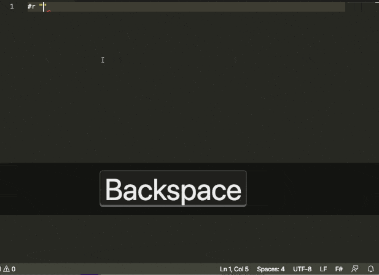

F# R Type Provider
=======


The F# Type Provider is a mechanism that enables smooth interoperability
between F# and [R](http://www.r-project.org/). 
The Type Provider discovers R packages that are available 
in your R installation and makes them available as .NET namespaces 
underneath the parent namespace `RProvider`. 

The Type Provider makes it possible to use 
all of R capabilities, from the F# interactive environment. 
It enables on-the-fly charting and data analysis using R packages, 
with the added benefit of IntelliSense over R, 
and compile-time type-checking that the R functions you are using exist. 
It allows you to leverage all of .NET libraries,
as well as F# unique capabilities to access and manipulate data 
from a wide variety of sources via Type Providers.



The above example is run through F# interactive (`dotnet fsi`).

### A Quick Demo

<div style="text-align:center;">
<iframe width="420" height="315" src="https://www.youtube.com/embed/tOd-qsjKU8Y" frameborder="0" allowfullscreen></iframe>
</div>

## What are R and F#?

[F#](http://fsharp.org) is a multi-paradigm language 
that supports functional, object and imperative programming, 
with the emphasis on functional-first programming. F# runs on the .NET runtime and is a compiled, 
statically typed language with a strong type system and type inference. 
F# is a general purpose programming language, and is particularly well-suited for scientific/numerical computing.

[R](http://www.r-project.org/) is an Open Source language for statistical computing. 
R offers a wide range of high-quality, community-developed packages, 
covering virtually every area of statistics, econometrics or machine learning. 
It is also famous for its charting capabilities, making it a great tool 
to produce publication-quality graphics. 
R is an interpreted, dynamically typed language that is typically used 
from its GUI, [RStudio](http://www.rstudio.com/), or command line interactive environment.

## Using the R Type Provider

RProvider is distributed as a nuget package. After [setting up the pre-requisites (installing .NET 5+, R and setting the R_HOME environment variable](requirements.html), you can use as follows:

In an F# script:
```fsharp
#r "nuget:RProvider"

open RProvider
```

To add to a .NET project, from the terminal:
```
dotnet add package RProvider
```

Contributing and copyright
--------------------------

The project has been originally developed by [BlueMountain Capital](https://www.bluemountaincapital.com/) and contributors.

For compilation of the source, you will need F# 5.0 or later.  For runtime you'll need .NET 5.

The project is hosted on [GitHub][gh] where you can [report issues][issues], fork the project and submit pull requests.

[gh]: https://github.com/fslaborg/RProvider
[issues]: https://github.com/fslaborg/RProvider/issues
[license]: https://github.com/fslaborg/RProvider/blob/master/LICENSE.md
